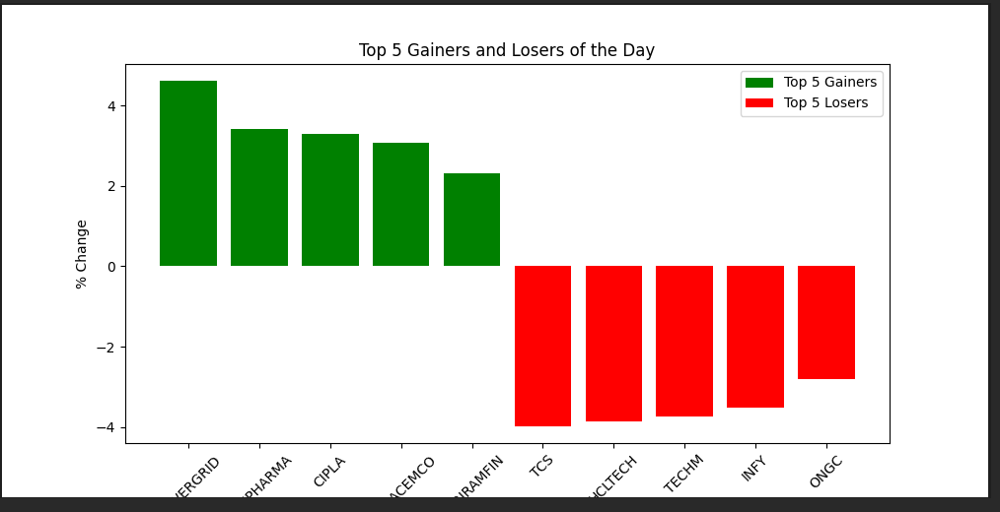

# NSE Data Analysis Project

## Overview
This project provides a Python-based solution to fetch and analyze stock market data from the National Stock Exchange (NSE) for the Nifty 50 index. It includes functionalities to identify market trends, top gainers and losers, and other key insights, along with visualizations.

## Features
- Fetch live Nifty 50 data from NSE.
- Identify:
    - Top 5 gainers and losers of the day.
    - 5 stocks trading 30% below their 52-week high.
    - 5 stocks trading 20% above their 52-week low.
    - Stocks with the highest returns in the last 30 days.
- Generate bar charts for top gainers and losers.

## Installation
1. Clone the repository:
        ```bash
        git clone <repository-url>
        ```
2. Navigate to the project directory:
        ```bash
        cd NSE
        ```
3. Install dependencies:
        ```bash
        pip install -r requirements.txt
        ```
4. Run Streamlit:
        ```bash
        streamlite run UI.py
        ```

## Usage
Run the Python script to fetch and analyze the data:
```bash
python nse_analysis.py
or
streamlite run Ui.py
```

## Output
- A summary of the top gainers, losers, and other insights will be displayed in the terminal.
- A bar chart visualizing the top 5 gainers and losers will be saved in the project directory.


## Sample Data Table

Below is an example of the data table generated by the analysis:

# Top 5 Gainer

| symbol      | lastPrice | dayHigh  | dayLow   | previousClose | change  | pChange | yearHigh | yearLow | perChange30d |
|-------------|-----------|----------|----------|---------------|---------|---------|----------|---------|--------------|
| POWERGRID   | 299.95    | 299.95   | 285.1    | 286.75        | 13.2    | 4.6     | 366.25   | 247.3   | 13.56        |
| SUNPHARMA   | 1772      | 1812.7   | 1750     | 1713.65       | 58.35   | 3.41    | 1960.35  | 1377.2  | 8.11         |
| CIPLA       | 1500      | 1523.3   | 1480     | 1452.35       | 47.65   | 3.28    | 1702.05  | 1317.25 | 3.18         |
| ULTRACEMCO  | 11595.1   | 11650.05 | 11155    | 11250.95      | 344.15  | 3.06    | 12145.35 | 9250    | 8.8          |
| SHRIRAMFIN  | 654.1     | 660.55   | 632      | 639.4         | 14.7    | 2.3     | 730.45   | 438.6   | 2.91         |

This table provides a snapshot of the stock data, including price changes, percentage changes, and performance metrics over the last 30 days.

# Top 5 Losers

| symbol   | lastPrice | dayHigh | dayLow   | previousClose | change   | pChange | yearHigh | yearLow  | perChange30d |
|----------|-----------|---------|----------|---------------|----------|---------|----------|----------|--------------|
| TCS      | 3403.3    | 3502    | 3396.15  | 3543.95       | -140.65  | -3.97   | 4592.25  | 3396.15  | 1.46         |
| HCLTECH  | 1468.4    | 1500    | 1465     | 1527.55       | -59.15   | -3.87   | 2012.2   | 1235     | -2.85        |
| TECHM    | 1370      | 1400    | 1360.25  | 1423.05       | -53.05   | -3.73   | 1807.7   | 1162.95  | -4.69        |
| INFY     | 1495.8    | 1534.65 | 1485.05  | 1550.15       | -54.35   | -3.51   | 2006.45  | 1358.35  | -9.27        |
| ONGC     | 243.59    | 249.62  | 242.51   | 250.64        | -7.05    | -2.81   | 345      | 215.48   | 11.33        |

This table highlights the top 5 stocks with the largest percentage losses, providing insights into their daily and 30-day performance metrics.


## Visualization

The project generates a bar chart to visualize the top 5 gainers and losers of the day. Below is an example of the output:

Top 5 Gainers and Losers 

This chart provides a clear representation of the percentage changes in stock prices for the top-performing and worst-performing stocks of the day.